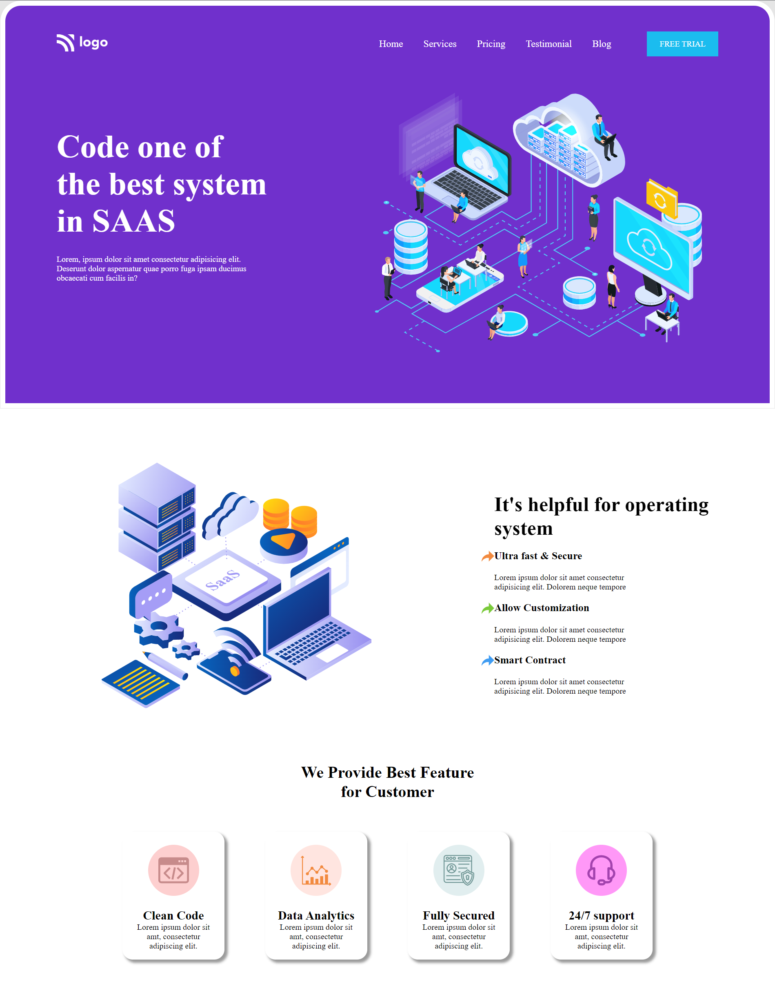

# Hey Welcome

Hi, My name is Uvesh Khatri and I have completed the 13th Project of the iNeuron Full Stack Course.

# Project 13

In this project i have created a SAAS Landing Page from Scratch. And i have learnt a lot of things like Position, flexbox.

It took me 5 Hours to complete this project
## Tech Stack Used 
- HTML5

- CSS

## My Project is looking like :

[Live Link](https://uveshkhatri-saas-landing-page.netlify.app/)